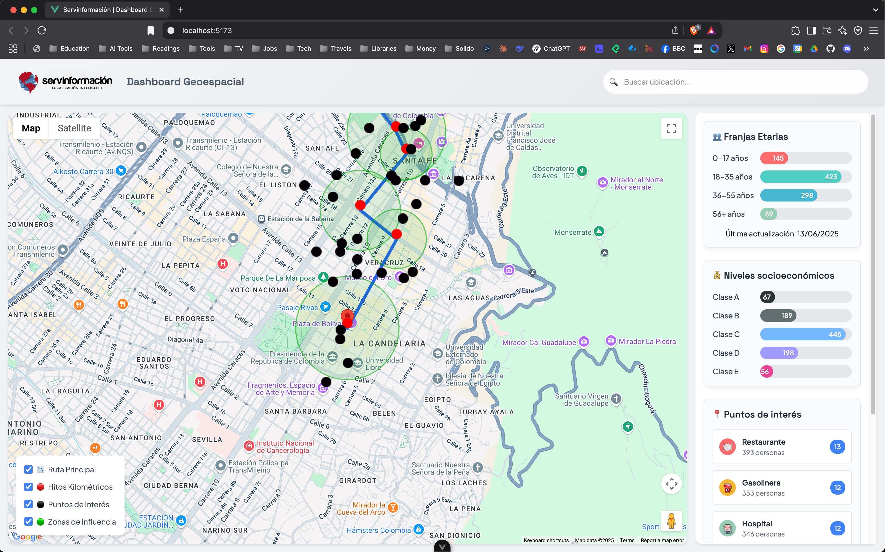

# dashboard-geoespacial

Prueba Técnica para optar al cargo de Desarrollador Frontend en Servinformación S.A.S 



## Configuración del proyecto

```sh
npm install
```

### Compilación y Hot-Reload para Desarrollo

```sh
npm run dev
```

### Compilación and Minificación para Producción

```sh
npm run build
```

### Linter con [ESLint](https://eslint.org/)

```sh
npm run lint
```
## Configuración personalizada

Ver [Vite Configuration Reference](https://vite.dev/config/).